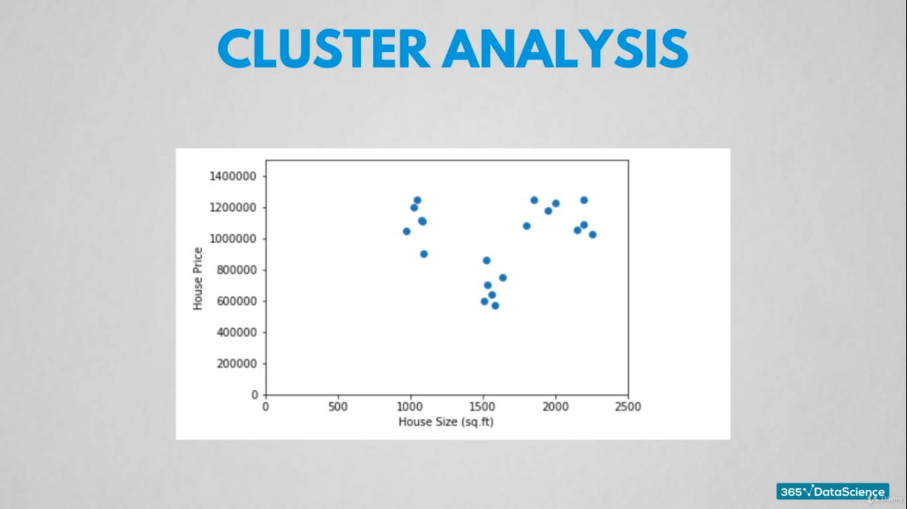

# Bootcamp layout

1. __What is data?__

    * Facts and statistics collected together for reference and analysis. It is mainly divided into two categories:

        * __Traditional Data__
        * __Big Data__

    * __Traditional Data vs Big Data__

   |Concepts  |  Traditional Data|    Big Data   |
   |----------- | ------------- |-------------|
   | __Data Size__ | Compartively Smaller | Massive when compared to traditional Data (Mostly of order of hundreds of terabytes)
    | __Relationships__ | Traditional Data has compartively easier data relationships than of big data | Big Data has massive amount of data so link between are very complex and not quite easy to figure out |
    | __Flexiblity__ | Traditional Data is not flexible since it is stored by the old fix methods of storing data | Big Data has no fixed architecture so it's quite flexible when compared to exploitation |
    | __Data Quality__ | Better chance of high quality data| Massive data is not always of massive quality|
    

2. What happens with data?
    * __Data is used to take the data-driven decision while minimising the risks involved.__

3. What is Data Science?
    * __Inter-Disciplinary Field which combines of analytical, statistical, programming, problem-solving, data-management__

    * __What is Business Intelligence?__
        * First step to apply data science is to have past data.
        * BI analyses the past data for insights, stability and edges.
            * For Example, Finding out what product gave you best profitablity margin.
            * Understanding past business performance to analyse what would be better for future.
    * __What are traditional methods and machine Learning?__
        * They come into play after BI reports of past have been generated and discussed.

        * __Tradtional Methods__
            * Used to get solid ideas with unprecedented accuracy of what is going to happen in future by using stastical analysis.

        * __Machine Learning__
            * Responsiblity is on the machine.

    __Traditional Methods and Machine Learning overlap but the key here is that traditional methods were developed in keep traditional data in mind__ 

## <u>Traditional Data and Big Data:</u> 

* __Raw Data:__
    * Cannot be analyzed directly needs processing over it.
    * This data is probelmatic even before it is of any use as we need to __pre-process__ it __before processing__ it to generate some information.

* __Data Pre-Processing:__
    * __Class Labelling__ 
        * Involves labelling the data point with correct data type or arranging data by category
        * Two Types:
            * __Numerical__ : Manipulative fields.
            * __Categorical__ : Non manipulative fields.
    
    * __Data Cleansing__:
        * __Goal__ : 
            * Is to deal with inconsistent data.
                * New York , Newe York, New Yokr
    
    * __Dealing with missing data:__
        * Either discard or use average depends upon you.

    * __Approaches specific to the type:__
        * __Traditional Data:__
            * __Balancing:__
                * Taking equal number of respondents from each group.

            * __Shuffling:__ 
                * prevents unwanted patterns
                * improves the predictive performance
                * help avoid the misleading results
        
        * __Big Data:__
            * __Text Data Mining:__
                * This refers to the __process of deriving valuable unstructured data from a text__
            
            * __Data Masking:__
                * Analyze the information without compromising the private information.

---

## After Preprocessing: 

Let's say we have pre-processed the data.

* By measuring sales volumes, new customer enrolled but these observations cannot be manipulated. Before jumping into all of the work let's define some of the most basic terminology.

    > First thing we do is to __quantify__ the observation available. So by definition, __Quantification__ is the representation of observations as a number so we can manipulate them as we like.
        
    > __Measure__ is known as accumulation of observation to show some information.

    > __Metric__ = Measure + Business Performance.

* __There are many many metrics to obtain and work upon. But not all of them are of the highest priority and meaning. So metrics should be chosen in such a way that they are tightly aligned with our business purpose.__
    
    > __KPI (Key Performance Indicator):__ Metrics related with our business goals.

    > All the traffic on your website can be a metric but the traffic generated on your site by clicking the advertisement of your ad-campaign. __Gives an insight whether or not to spend more on ad-campaign or not__.

---

## After Bi-Reports have been created:

* We are on the verge of applying predictive analysis.

* A word we are going to stumble upon a lot of time is
 
## __Regression:__

Regression is a model used for quantifying casual relationships among the different variables included in your analysis.

* Red line shows the graphical distribution link better than the others.

## __Logistic Regression: Non linear model.__

__If you pay 1700 to a coding society, people like Hari Prasad get free coffee,food for himself which is a win(1) but if you are smart enough to spot a fraud than the result for him is (0).__

## __Clustering:__

Clustering is a model in which data is plotted is in form of clusters meaning they form groups and they provide very valuable insights.

__Here we have plotted the data of houses in America in some neighbourhoods.__

*  X-axis represents the House Size(sq ft).
* Y-axis represents the cose of house.

We can see that:

So the clusters are predictive on their own as shown.

        

        

        

            

        